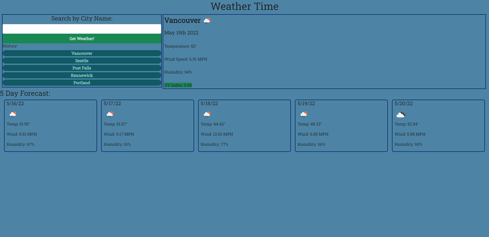

# weather-forecast

## Description
    This page is a weather fetcher that can get and display both a current and weekly weather forecast for a user-inputted city. The searches are also saved locally for a user to check their recent querys.

## Technologies Used
    This application utilizes:
    * The openweather API
    * Node JS
    * Bootstrap
    * 

## Usage
    To use the application a user inputs the name of a city into the input box and submits the form, the current and forecasted weather will render to their respective sections. In order to render a saved search from the history section, the user must click the button with the desired city name.

    Sceeenshot of application below:

## Deployed Application Link
https://eyesackel.github.io/weather-forecast/
